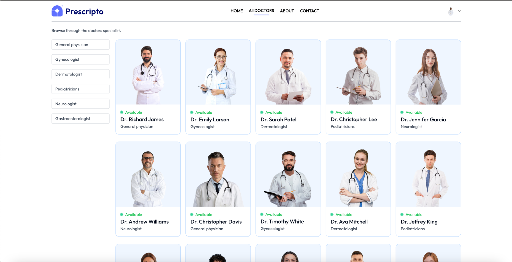
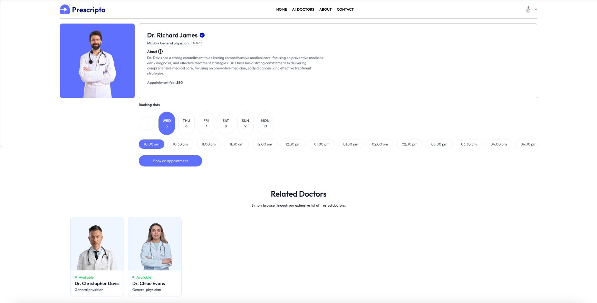
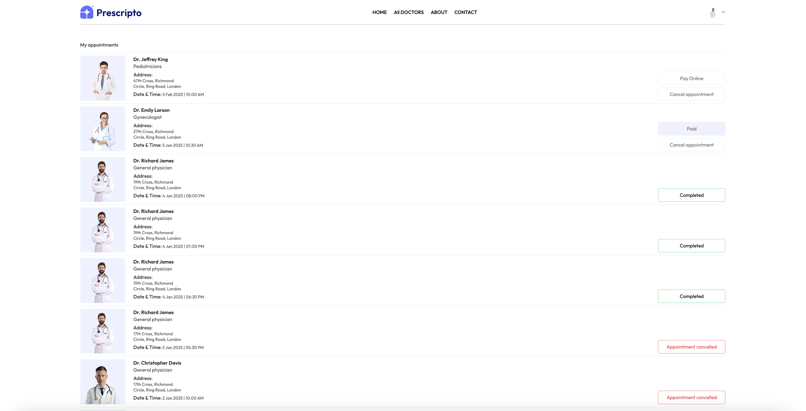
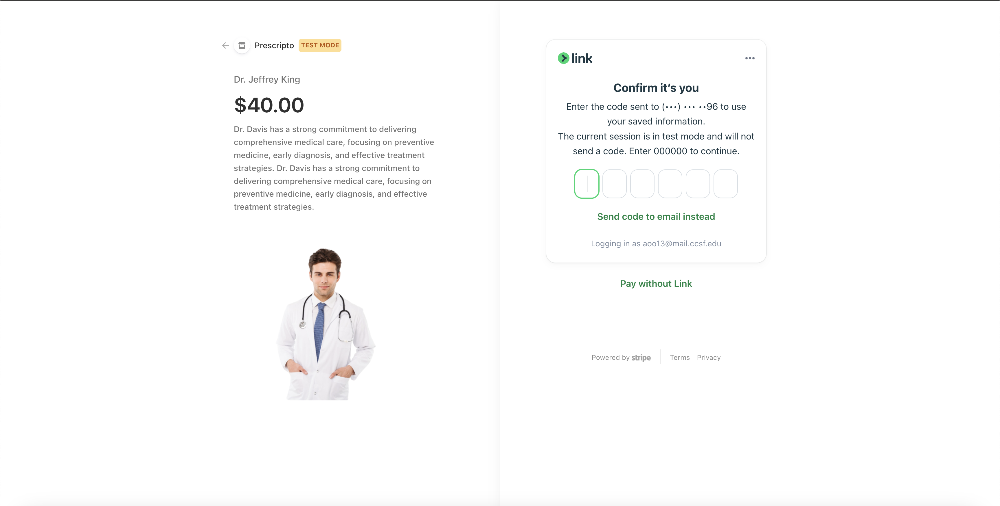
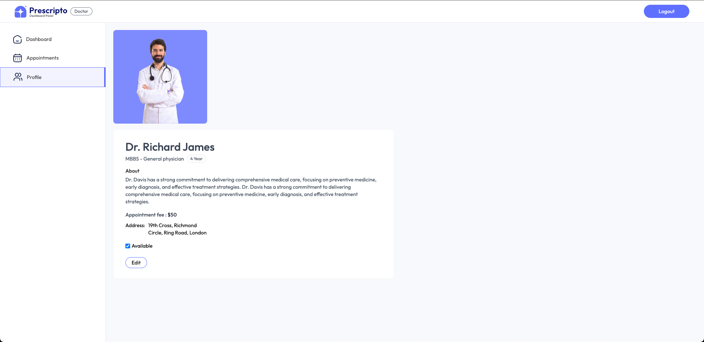
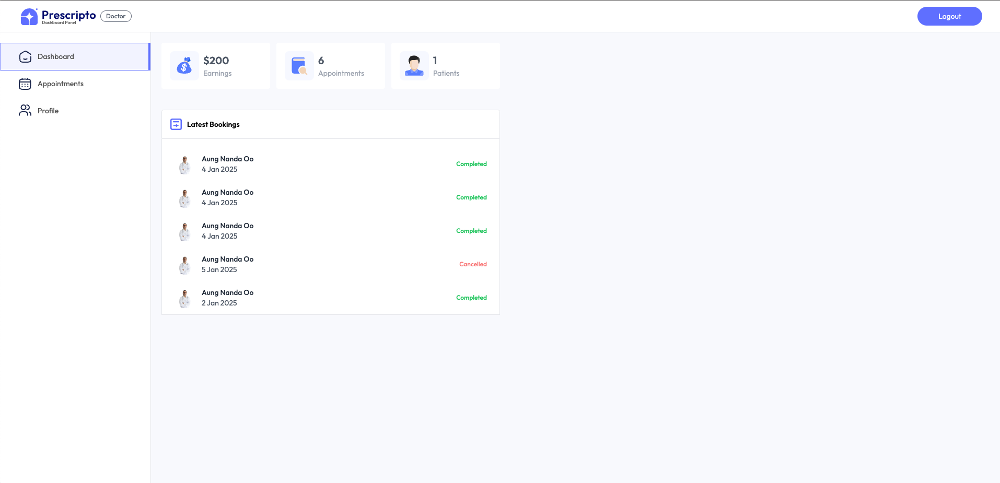
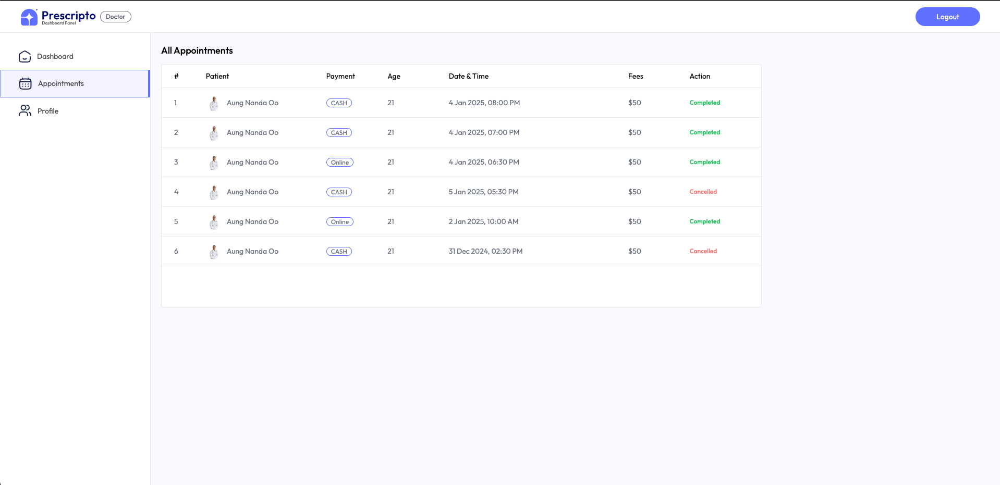

# 👨‍⚕️ Medical Appointment Booking System

A full-stack medical appointment booking system built with **MERN** stack (MongoDB, Express.js, React, Node.js) and integrated with Cloudinary for image uploads and Stripe for payments.

## 📸 User Side Demo

#### Landing Page
 

### Doc Availability
 

### Doc Booking & related doctor recommendation
 

### User appointment checking & payment method
 

### Stripe Payment
 

## 📸 Admin/Doc Side Demo

### Admin/Doc Profile
 

### Admin/Doc Dashboard
 

### Admin/Doc Appointment_listing.png
 

## ✨ Features

* 👨‍⚕️ Doctor Management: Admin can add, update, and manage doctors.

*  📅 Appointment Booking: Users can book and manage doctor appointments.

* 🔑 Authentication & Authorization: JWT-based user authentication (Patients, Doctors, Admins).

* 💳 Payment Integration: Secure payment processing with Stripe.

* ☁️ Image Upload: Profile picture uploads using Cloudinary.

* 📊 Dashboards: Dedicated dashboards for Admins, Doctors, and Users.

## 📂 Folder Structure
```bash
📦 project-root
├── 📁 backend         # Server-side code
│   ├── 📁 config      # Database & Cloudinary config
│   ├── 📁 controllers # Business logic
│   ├── 📁 middlewares # Auth middleware across user role
│   ├── 📁 models      # Database schemas
│   ├── 📁 routes      # API endpoints
│   ├── server.js      # Main Express server
│
├── 📁 frontend        # Client-side code
│   ├── 📁 src         # React components & pages
│       ├── 📁 assets      # Static files
│       ├── 📁 components  # Reusable components
│       ├── 📁 contexts    # CreateContext hook
│       ├── 📁 pages       # Unique Pages
│
└── 📄 README.md       # Project documentation
```

## 🛠️ Tech Stack

Frontend

* React.js

*  React Router

*  TailwindCSS

* Axios

Backend

* Node.js

* Express.js

* MongoDB (Mongoose)

* Cloudinary

* Stripe API

## 🚀 Installation & Setup

### 1️⃣ Clone the Repository
```bash
git clone https://github.com/NikkiAung/Doctor-Appointment-Booking-System.git
cd medical-booking-system
```

### 2️⃣ Install Dependencies

Backend Setup
```bash
cd backend
npm install
```

Frontend Setup
```bash
cd frontend
npm install
```

### 3️⃣ Set Up Environment Variables
Create a .env file in the backend directory and add:
```bash
PORT=4000
MONGODB_URI=your_mongo_db_connection
CLOUDINARY_NAME=your_cloudinary_name
CLOUDINARY_API_KEY=your_cloudinary_api_key
CLOUDINARY_SECRET_KEY=your_cloudinary_secret
JWT_SECRET=your_jwt_secret
STRIPE_SECRET_KEY=your_stripe_key
CLIENT_SITE_URL=http://localhost:5173
```

### 4️⃣ Start the Server
```bash
cd backend
npm run dev
```

### 5️⃣ Start the Frontend
```bash
cd frontend
npm run dev
```
## 🔥 API Endpoints

| Route                        | Method | Description             |
|------------------------------|--------|-------------------------|
| `/api/user/register`         | POST   | Register a new user     |
| `/api/user/login`            | POST   | Login user              |
| `/api/user/book-appointment` | POST   | Book an appointment     |
| `/api/admin/add-doctor`      | POST   | Admin adds a new doctor |
| `/api/doctor/login`          | POST   | Doctor login            |
| `/api/doctor/appointments`   | GET    | Doctor's appointments   |


## 🔗 Admin Panel Access
🔹 Admin Dashboard: Doctor Appointment Booking System Admin

🔹 Test Credentials:

```bash
{
    "email": "richard@demo.com",
    "password": "12345678"
}
```

## 🛠️ Deployment

* Frontend can be deployed on Render /Vercel / Netlify.

* Backend can be hosted on Render / Railway / Heroku.

* MongoDB can be hosted on MongoDB Atlas.
